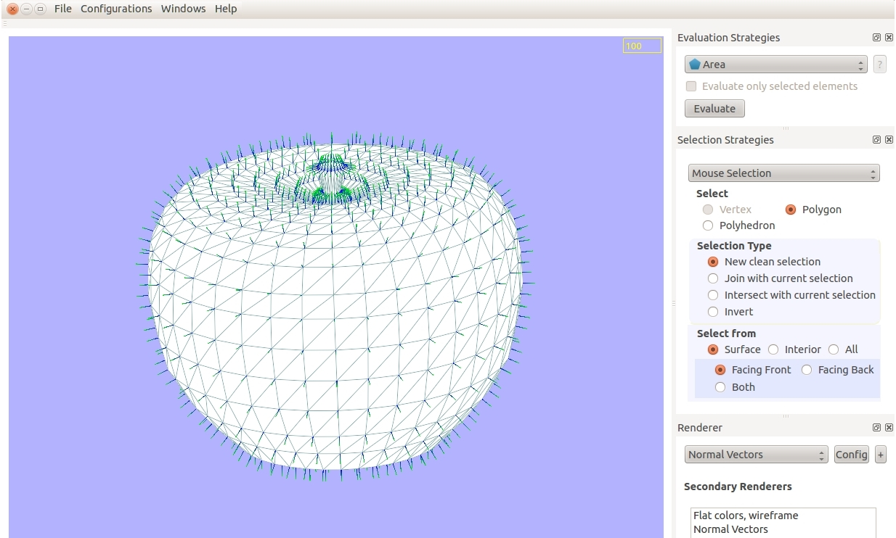

3D Mesh visualization software, support for Linux and Windows (Mingw64/Msys2) environments

## Description

About Camarón Camarón is an innovative multi-platform freely available software used to display and analyze mixed 3-D geometric meshes. This application has different renders that allows the user to load, study, evaluate and export geometric meshes in various formats.

In addition, Camarón leverages current technologies to get it's optimum performance in order to allow the analysis of large
geometric meshes (over 1 million items).

This software was created by Aldo Canepa Garay in 2012 as part of his Civil Engineering degree in Computer Science at University of Chile and
the development of Camarón was supported by Fondecyt Project Nr 1120495 "Improving the functionality and performance of meshing tools".
Head of the project: Nancy Hitschfeld Kahler 2012-2013.

