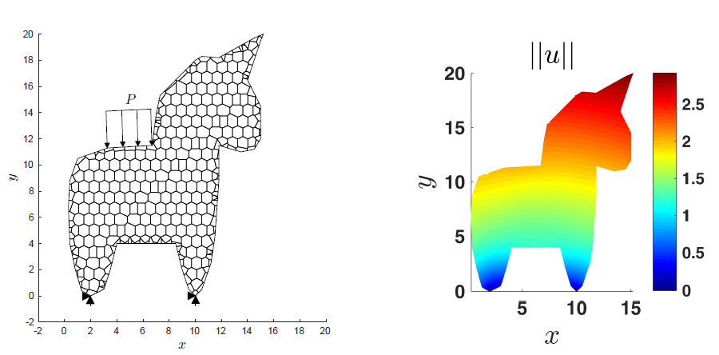

  <a class="btn btn-outline-primary btn-page-header btn-sm" href="https://github.com/cemcen/Veamy" target="_blank" rel="noopener">
    <i class="fab fa-github mr-1"></i>Main version</a>

  <a class="btn btn-outline-primary btn-page-header btn-sm" href="https://camlab.cl/veamy/" target="_blank" rel="noopener">
    <i class="fas fa-link mr-1"></i>Dedicated website</a>

Free and open-source C++ library that implements the virtual element method. The current release of this library allows the solution of 2D linear elastostatic problems and the 2D Poisson problem. The 2D linear elastostatic problem can also be solved using the standard three-node finite element triangle. For this, a module called Feamy is available within Veamy.

- Includes its own mesher based on the computation of the constrained Voronoi diagram. The meshes can be created in arbitrary domains, with or without holes, with procedurally generated points.
- Meshes can also be read from OFF-style text files (an example can be found in the test folder).
- Allows easy input of boundary conditions by constraining domain segments and nodes.
- The results of the computation can be either written into a file or used directly.
- PolyMesher‘s meshes and boundary conditions can be read straightforwardly in Veamy to solve problems using the VEM.